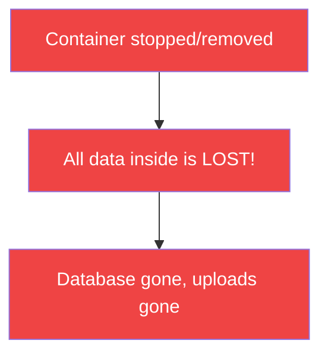
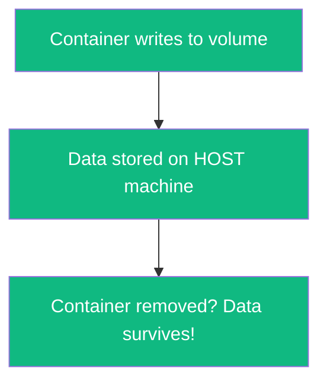
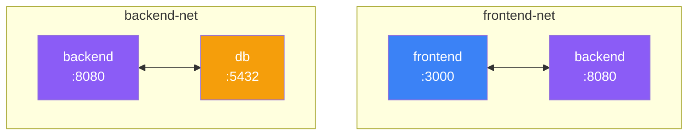

# Docker Compose

Multi-container application orchestration

---

# What is Docker Compose?

<div class="grid grid-cols-2 gap-8">

<div>

## Key Features

- **Tool for defining multi-container applications**
- **YAML configuration** - `docker-compose.yml`
- **Single command** - start/stop entire stack
- **Perfect for local development** and testing

</div>

<div>

## Instead of...

```bash
# Running multiple commands:
docker run -d --name db \
  -e POSTGRES_PASSWORD=secret postgres

docker run -d --name app \
  --link db:db -p 3000:3000 my-app
```

You define everything in one file!

</div>

</div>

---

# Docker Compose File Structure

```yaml
version: '3.8'                    # Compose file version

services:                         # Container definitions
  app:                            # Service name
    build: .                      # Build from Dockerfile
    ports:
      - "3000:3000"               # Port mapping
    environment:
      - NODE_ENV=production       # Environment variables
    depends_on:
      - db                        # Start order dependency

  db:
    image: postgres:16-alpine     # Use existing image
    volumes:
      - postgres_data:/var/lib/postgresql/data
    environment:
      - POSTGRES_PASSWORD=secret

volumes:                          # Named volumes
  postgres_data:
```

---

# Common Docker Compose Commands

```bash
# Start services
docker compose up                 # Start in foreground
docker compose up -d              # Start in background (detached)
docker compose up --build         # Rebuild images before starting

# Stop services
docker compose down               # Stop and remove containers
docker compose down -v            # Also remove volumes

# View status
docker compose ps                 # List running services
docker compose logs               # View logs
docker compose logs -f app        # Follow logs for specific service

# Execute commands
docker compose exec app sh        # Shell into running container
docker compose run app npm test   # Run one-off command
```

---

# Full Stack Example

<div class="grid grid-cols-2 gap-4">

```yaml
services:
  frontend:
    build: ./frontend
    ports:
      - "3000:3000"
    depends_on:
      - backend

  backend:
    build: ./backend
    ports:
      - "8080:8080"
    environment:
      - DATABASE_URL=postgresql://...
    depends_on:
      - db
```

```yaml
  db:
    image: postgres:16-alpine
    environment:
      - POSTGRES_USER=user
      - POSTGRES_PASSWORD=pass
      - POSTGRES_DB=mydb
    volumes:
      - postgres_data:/var/lib/...

volumes:
  postgres_data:
```

</div>

---

# Environment Variables - 3 Methods

<div class="grid grid-cols-3 gap-3">

<div>

### 1. Inline (hardcoded)

```yaml
services:
  app:
    environment:
      - NODE_ENV=production
      - DEBUG=false
```

<div class="text-xs mt-2 text-yellow-400">

Not for secrets!

</div>

</div>

<div>

### 2. Variable substitution

```yaml
services:
  app:
    environment:
      - API_KEY=${API_KEY}
      - DB_PASS=${DB_PASS:-default}
```

<div class="text-xs mt-2">

Reads from shell or `.env`

</div>

</div>

<div>

### 3. env_file

```yaml
services:
  app:
    env_file:
      - .env
      - .env.local
```

<div class="text-xs mt-2">

Loads entire file into container

</div>

</div>

</div>

---

# Environment Variables - .env Files

<div class="grid grid-cols-2 gap-6">

<div>

### .env file (auto-loaded)

```plaintext
# .env - loaded automatically by Compose
POSTGRES_USER=myapp
POSTGRES_PASSWORD=secretpass123
POSTGRES_DB=myapp_db
API_KEY=sk-abc123
```

<div class="p-2 bg-red-500 bg-opacity-10 rounded text-sm mt-2">

Add `.env` to `.gitignore`!

</div>

</div>

<div>

### .env.example (commit this)

```plaintext
# .env.example - template for developers
POSTGRES_USER=
POSTGRES_PASSWORD=
POSTGRES_DB=
API_KEY=
```

<div class="p-2 bg-green-500 bg-opacity-10 rounded text-sm mt-2">

Share structure, not secrets

</div>

</div>

</div>

---

# Environment Variables - Precedence

<div class="grid grid-cols-2 gap-6">

<div>

### Priority (highest to lowest)

1. `docker compose run -e VAR=value`
2. Shell environment variables
3. `.env` file in project directory
4. `env_file` in compose file
5. `environment` in compose file
6. Dockerfile `ENV`

</div>

<div>

### Default values syntax

```yaml
environment:
  # Use default if not set
  - PORT=${PORT:-3000}

  # Error if not set
  - API_KEY=${API_KEY:?API_KEY required}

  # Empty string if not set
  - DEBUG=${DEBUG-}
```

</div>

</div>

---

# Volumes - Why We Need Them

<div class="grid grid-cols-2 gap-6">

<div>

### The Problem



Containers are **ephemeral** - they don't persist data by default.

</div>

<div>

### The Solution: Volumes



Volumes **persist data** outside the container lifecycle.

</div>

</div>

---

# Volumes - Two Types

<div class="grid grid-cols-2 gap-6">

<div>

### Named Volumes (Managed by Docker)

```yaml
services:
  db:
    volumes:
      - postgres_data:/var/lib/postgresql/data

volumes:
  postgres_data:  # Docker manages location
```

- Docker manages storage location
- Best for **production data**
- Survives `docker compose down`
- Removed with `docker compose down -v`

</div>

<div>

### Bind Mounts (Your folders)

```yaml
services:
  app:
    volumes:
      - ./src:/app/src        # Your code
      - ./config:/app/config:ro  # Read-only
```

- Maps host directory → container
- Best for **development** (hot-reload)
- Changes sync instantly both ways
- `:ro` = container can't modify

</div>

</div>

---

# Volumes - Common Use Cases

| Use Case | Volume Type | Example |
|----------|-------------|---------|
| Database data | Named volume | `db_data:/var/lib/postgresql/data` |
| User uploads | Named volume | `uploads:/app/uploads` |
| Source code (dev) | Bind mount | `./src:/app/src` |
| Config files | Bind mount (ro) | `./nginx.conf:/etc/nginx/nginx.conf:ro` |
| Logs | Named volume | `logs:/var/log/app` |

```yaml
volumes:
  db_data:
  uploads:
    driver: local  # Default, stores on host filesystem
  logs:
```

---

# Networks - Default Behavior

<div class="grid grid-cols-2 gap-6">

<div>

### What happens automatically

```yaml
services:
  backend:
    image: my-backend

  db:
    image: postgres
```

Docker Compose creates a **default network** - all services can reach each other by **service name**.

</div>

<div>

### How services communicate

```javascript
// In backend code:
const db = new Pool({
  host: 'db',  // Service name = hostname!
  port: 5432,
  ...
});
```

```bash
# From backend container:
ping db        # Works!
curl frontend  # Works!
```

</div>

</div>

---

# Networks - Custom Networks

<div class="grid grid-cols-2 gap-6">

<div>

### Why custom networks?

<div class="text-xs">

<div class="p-2 bg-red-500 bg-opacity-10 rounded mb-2">

**Without isolation:**

<div class="flex items-center justify-center gap-2 mt-1">
  <span class="px-2 py-1 border border-slate-400 rounded">frontend</span>
  <span>↔</span>
  <span class="px-2 py-1 border border-slate-400 rounded">backend</span>
  <span>↔</span>
  <span class="px-2 py-1 border border-slate-400 rounded">db</span>
</div>
<div class="text-center text-red-400 mt-1">frontend ↔ db = Security risk!</div>

</div>

<div class="p-2 bg-green-500 bg-opacity-10 rounded">

**With isolation:**

<div class="flex items-center justify-center gap-2 mt-1">
  <span class="px-2 py-1 border border-blue-400 rounded">frontend</span>
  <span>↔</span>
  <span class="px-2 py-1 border border-purple-400 rounded">backend</span>
  <span>↔</span>
  <span class="px-2 py-1 border border-amber-400 rounded">db</span>
</div>
<div class="text-center text-green-400 mt-1">frontend ✗ db = Protected!</div>

</div>

</div>

</div>

<div>

### Implementation

```yaml
services:
  frontend:
    networks: [frontend-net]

  backend:
    networks: [frontend-net, backend-net]

  db:
    networks: [backend-net]

networks:
  frontend-net:
  backend-net:
```

</div>

</div>

---

# Networks - Visual Example



<div class="grid grid-cols-2 gap-4 mt-4 text-sm">
  <div class="p-2 bg-green-500 bg-opacity-10 rounded">
    <span class="text-blue-400">frontend</span> can reach: backend ✓<br/>
    <span class="text-purple-400">backend</span> can reach: frontend ✓, db ✓<br/>
    <span class="text-amber-400">db</span> can reach: backend ✓
  </div>
  <div class="p-2 bg-red-500 bg-opacity-10 rounded">
    <span class="text-blue-400">frontend</span> can reach db: ✗<br/>
    <span class="text-slate-400 text-xs">(different network!)</span>
  </div>
</div>

---

# Health Checks

```yaml
services:
  backend:
    build: ./backend
    healthcheck:
      test: ["CMD", "curl", "-f", "http://localhost:8080/health"]
      interval: 30s
      timeout: 10s
      retries: 3
      start_period: 40s

  db:
    image: postgres:16-alpine
    healthcheck:
      test: ["CMD-SHELL", "pg_isready -U postgres"]
      interval: 10s
      timeout: 5s
      retries: 5
```

---
layout: center
---

# Practice: Docker Compose

<div class="grid grid-cols-2 gap-6">

<div>

### Create `docker-compose.yml`

```yaml
services:
  db:
    image: postgres:16-alpine
    environment:
      POSTGRES_USER: admin
      POSTGRES_PASSWORD: secret
      POSTGRES_DB: myapp
    volumes:
      - postgres_data:/var/lib/postgresql/data

  pgadmin:
    image: dpage/pgadmin4
    environment:
      PGADMIN_DEFAULT_EMAIL: admin@admin.com
      PGADMIN_DEFAULT_PASSWORD: admin
    ports:
      - "5050:80"
    depends_on:
      - db

volumes:
  postgres_data:
```

</div>

<div>

### Steps

1. Create the `docker-compose.yml`
2. Run `docker compose up -d`
3. Open http://localhost:5050
4. Login with `admin@admin.com` / `admin`
5. Add server:
   - Host: `db` (service name!)
   - Port: `5432`
   - User: `admin`
   - Password: `secret`
6. Explore the database

</div>

</div>

