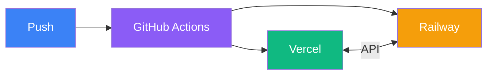

# Summary

Bringing it all together

---

# What We Covered

| Topic | Key Takeaways |
|-------|---------------|
| **Docker** | Containers, images, Dockerfile, multi-stage builds |
| **Docker Compose** | Multi-container apps, volumes, networks, environment |
| **GitHub Actions** | CI/CD workflows, triggers, secrets, Docker build/push |
| **Vercel** | Frontend deployment, preview deploys, environment config |
| **Spring Boot + Jib** | Containerize Java apps without Docker, deploy to Railway |

---

# Deployment Architecture

  

    
GitHub

    
Push | Actions | CI/CD

  

  

    
Vercel (Frontend)

    
Next.js | Auto SSL | Edge CDN

  

  

    
Railway (Backend)

    
Spring Boot | PostgreSQL | Auto SSL

  

---

# CI/CD Flow

## Frontend (Vercel)

1. Push to GitHub
2. Vercel auto-detects
3. Builds & deploys
4. Preview URL for PRs
5. Production on merge

## Backend (Railway)

1. Push to GitHub
2. GitHub Actions triggers
3. Jib builds container
4. Push to GHCR
5. Webhook triggers Railway
6. Railway pulls & deploys

---

# Key Takeaways

### Docker

- Containers = portable environments
- Multi-stage builds = smaller images
- Docker Compose = local development

### CI/CD

- Automate everything
- Lint & test before deploy
- Use secrets for credentials

### Frontend (Vercel)

- Zero-config deploys
- Preview deployments for PRs
- Edge network = fast globally

### Backend (Railway)

- Jib = no Dockerfile needed
- GHCR = free container registry
- Railway = no server management

---

# Best Practices Checklist

### Security

- [ ] Use secrets, never hardcode
- [ ] HTTPS everywhere
- [ ] Non-root containers
- [ ] Regular dependency updates

### Reliability

- [ ] Health checks
- [ ] Auto-restart policies
- [ ] Database backups
- [ ] Monitoring/logging

### Performance

- [ ] Multi-stage builds
- [ ] Layer caching
- [ ] CDN for static assets
- [ ] Connection pooling

### Development

- [ ] Local Docker Compose
- [ ] Preview deployments
- [ ] Branch protection
- [ ] Code review process

